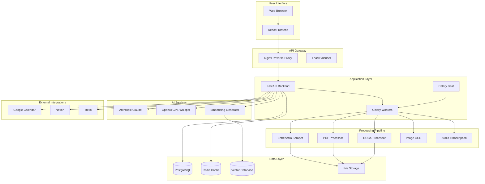
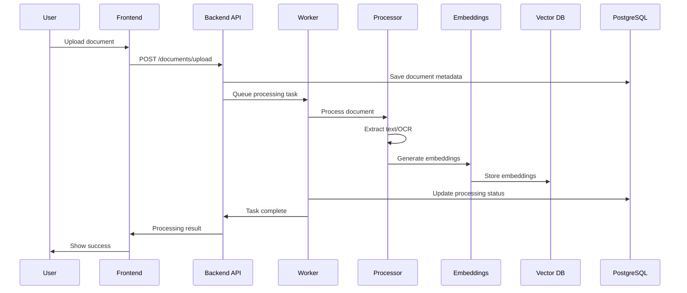
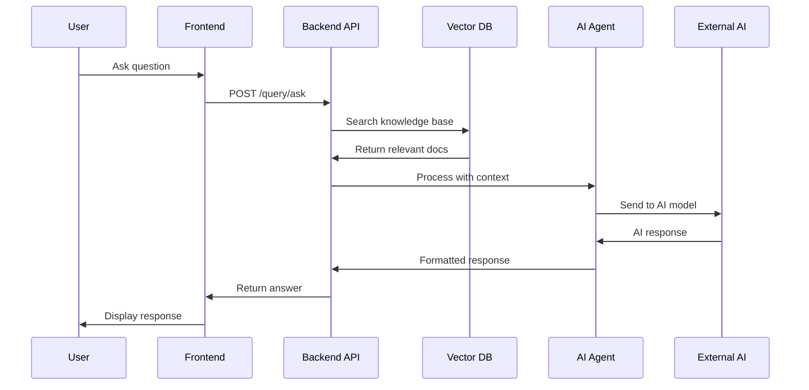
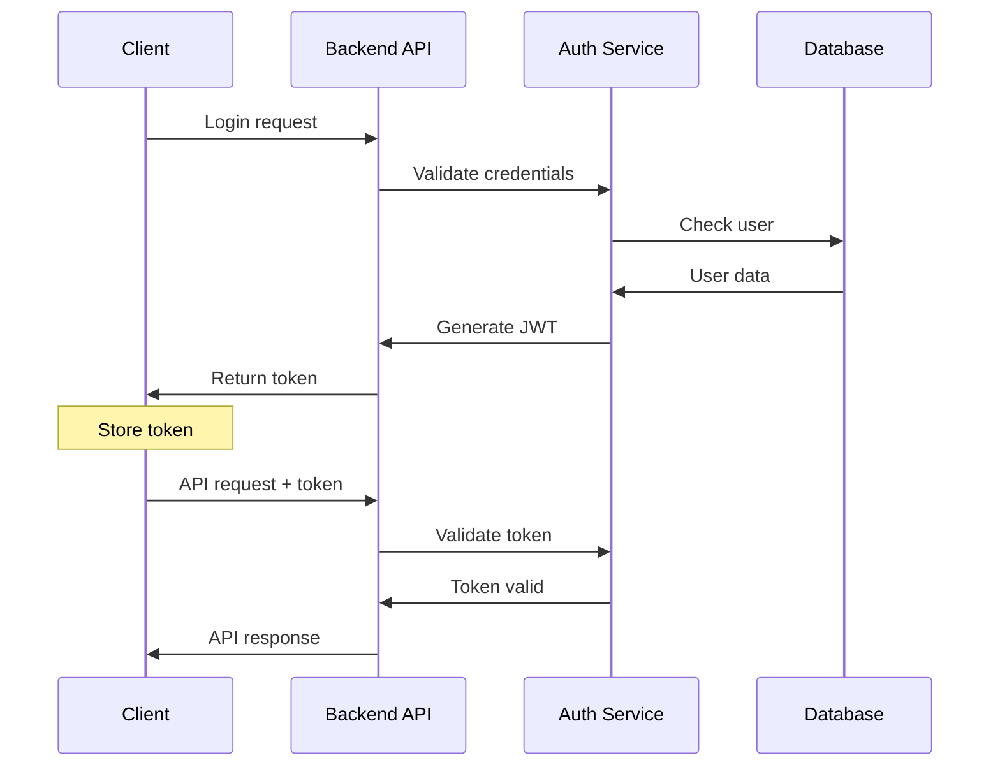

# Entrepedia AI Platform - Architecture Overview

This document provides a comprehensive overview of the system architecture, design patterns, and technical decisions behind the Entrepedia AI Platform.

## 🏛️ High-Level Architecture



## 🔧 System Components

### Frontend Layer

#### React Application
- **Framework**: React 18 with TypeScript
- **Routing**: React Router DOM
- **State Management**: Zustand for global state
- **UI Components**: Custom components with Tailwind CSS
- **Build Tool**: Vite for fast development and building

**Key Features:**
- Responsive design for desktop and mobile
- Real-time chat interface with AI agents
- File upload with drag-and-drop support
- Knowledge graph visualization
- Dashboard with analytics and progress tracking

#### Component Architecture
```
src/
├── components/
│   ├── Layout/           # Application shell
│   ├── Chat/            # AI chat interface
│   ├── FileUpload/      # Document upload
│   ├── KnowledgeGraph/  # Knowledge visualization
│   └── Dashboard/       # Analytics dashboard
├── services/
│   └── api.ts          # API client
├── stores/
│   └── useStore.ts     # Global state management
└── utils/
    └── helpers.ts      # Utility functions
```

### Backend Layer

#### FastAPI Application
- **Framework**: FastAPI with async/await support
- **Authentication**: JWT-based with Bearer tokens
- **Validation**: Pydantic models for request/response
- **Documentation**: Auto-generated OpenAPI/Swagger docs
- **Middleware**: CORS, authentication, logging

**API Structure:**
```python
backend/
├── api/
│   ├── main.py          # FastAPI app
│   └── routes/
│       ├── auth.py      # Authentication endpoints
│       ├── documents.py # Document management
│       ├── query.py     # AI agent interactions
│       └── integrations.py # External services
├── agents/              # AI agent implementations
├── processors/          # Document processing
├── embeddings/          # Vector operations
├── scraper/            # Web scraping
└── utils/              # Shared utilities
```

#### Task Queue System
- **Celery**: Distributed task queue for async operations
- **Redis**: Message broker and result backend
- **Beat Scheduler**: Periodic task execution
- **Workers**: Scalable background processing

**Task Types:**
- Document processing and OCR
- Embedding generation
- Scheduled course scraping
- Batch operations
- Integration synchronization

### AI Services Layer

#### Agent Architecture
```python
class BaseAgent(ABC):
    """Base class for all AI agents"""

    def __init__(self, name: str, system_prompt: str):
        self.name = name
        self.system_prompt = system_prompt
        self.conversation_history = []

    @abstractmethod
    def process_query(self, query: str, context: Dict[str, Any]) -> Dict[str, Any]:
        """Process user query and return response"""
        pass
```

#### Specialized Agents

**Coach Agent**
- Personalized learning guidance
- Motivation and encouragement
- Study plan creation
- Progress tracking support

**Strategist Agent**
- Comprehensive learning strategies
- Resource optimization
- Timeline planning
- Risk assessment

#### AI Model Integration
```python
# Anthropic Claude
response = self.anthropic_client.messages.create(
    model="claude-3-sonnet-20240229",
    max_tokens=1024,
    system=self.system_prompt,
    messages=[{"role": "user", "content": message}]
)

# OpenAI GPT
response = self.openai_client.chat.completions.create(
    model="gpt-3.5-turbo",
    messages=messages,
    max_tokens=1024
)
```

### Document Processing Pipeline

#### Multi-Format Support
```python
class ProcessingPipeline:
    def __init__(self):
        self.processors = {
            '.pdf': PDFProcessor(),
            '.docx': DOCXProcessor(),
            '.jpg': ImageProcessor(),
            '.mp3': AudioProcessor(),
        }

    def process(self, file_path: Path) -> Dict[str, Any]:
        processor = self.processors.get(file_path.suffix.lower())
        return processor.process(file_path)
```

#### Processing Stages
1. **File Detection**: Identify format and select processor
2. **Content Extraction**: Extract text, images, metadata
3. **Enhancement**: OCR, transcription, cleanup
4. **Segmentation**: Split into logical chunks
5. **Enrichment**: Summaries, keywords, flashcards
6. **Indexing**: Generate embeddings and store

### Vector Database Layer

#### Unified Interface
```python
class VectorStore:
    def __init__(self, store_type: str):
        if store_type == "faiss":
            self.store = FAISSVectorStore()
        elif store_type == "pinecone":
            self.store = PineconeVectorStore()
        elif store_type == "weaviate":
            self.store = WeaviateVectorStore()
```

#### Embedding Generation
```python
class EmbeddingGenerator:
    def generate_embeddings(
        self,
        texts: List[str],
        model: str = "sentence-transformer"
    ) -> List[Dict[str, Any]]:
        # Chunk texts for optimal embedding
        chunked_texts = self._chunk_texts(texts)

        # Generate embeddings
        if model == "openai":
            embeddings = self._generate_openai_embeddings(chunked_texts)
        else:
            embeddings = self._generate_sentence_transformer_embeddings(chunked_texts)

        return embeddings
```

### Data Layer

#### Database Schema
```sql
-- Documents table
CREATE TABLE documents (
    id SERIAL PRIMARY KEY,
    filename VARCHAR(255) NOT NULL,
    file_type VARCHAR(50),
    source VARCHAR(100),
    processed_at TIMESTAMP DEFAULT CURRENT_TIMESTAMP,
    metadata JSONB
);

-- Embeddings table
CREATE TABLE embeddings (
    id SERIAL PRIMARY KEY,
    document_id INTEGER REFERENCES documents(id),
    content TEXT,
    vector_id VARCHAR(255),
    chunk_index INTEGER,
    created_at TIMESTAMP DEFAULT CURRENT_TIMESTAMP
);

-- User conversations
CREATE TABLE conversations (
    id SERIAL PRIMARY KEY,
    user_id INTEGER,
    agent_type VARCHAR(50),
    messages JSONB,
    created_at TIMESTAMP DEFAULT CURRENT_TIMESTAMP
);
```

#### Caching Strategy
```python
# Redis cache configuration
CACHE_CONFIG = {
    'embeddings': 3600,      # 1 hour
    'search_results': 300,    # 5 minutes
    'user_sessions': 86400,   # 24 hours
    'api_responses': 60,      # 1 minute
}
```

## 🔄 Data Flow

### Document Processing Flow


### Query Processing Flow


## 🏗️ Design Patterns

### Repository Pattern
```python
class DocumentRepository:
    def __init__(self, db_session):
        self.db = db_session

    def create(self, document: Document) -> Document:
        self.db.add(document)
        self.db.commit()
        return document

    def get_by_id(self, doc_id: int) -> Optional[Document]:
        return self.db.query(Document).filter(Document.id == doc_id).first()
```

### Factory Pattern
```python
class ProcessorFactory:
    @staticmethod
    def create_processor(file_type: str) -> BaseProcessor:
        processors = {
            'pdf': PDFProcessor,
            'docx': DOCXProcessor,
            'image': ImageProcessor,
        }
        processor_class = processors.get(file_type)
        if not processor_class:
            raise ValueError(f"Unsupported file type: {file_type}")
        return processor_class()
```

### Observer Pattern
```python
class ProcessingEventManager:
    def __init__(self):
        self.observers = []

    def subscribe(self, observer):
        self.observers.append(observer)

    def notify(self, event_type: str, data: Dict[str, Any]):
        for observer in self.observers:
            observer.handle_event(event_type, data)
```

### Strategy Pattern
```python
class EmbeddingStrategy(ABC):
    @abstractmethod
    def generate(self, texts: List[str]) -> List[List[float]]:
        pass

class OpenAIEmbeddingStrategy(EmbeddingStrategy):
    def generate(self, texts: List[str]) -> List[List[float]]:
        # OpenAI implementation
        pass

class SentenceTransformerStrategy(EmbeddingStrategy):
    def generate(self, texts: List[str]) -> List[List[float]]:
        # Sentence transformer implementation
        pass
```

## 🔧 Configuration Management

### Environment-Based Configuration
```python
class Settings(BaseSettings):
    # Application
    app_name: str = "Entrepedia AI Platform"
    app_env: Literal["development", "staging", "production"] = "development"
    debug: bool = True

    # Database
    database_url: str
    redis_url: str = "redis://localhost:6379/0"

    # AI Services
    anthropic_api_key: str
    openai_api_key: str

    # Vector Database
    vector_db_type: Literal["faiss", "pinecone", "weaviate"] = "faiss"

    class Config:
        env_file = ".env"
        case_sensitive = False
```

### Feature Flags
```python
class FeatureFlags:
    ENABLE_AUDIO_PROCESSING = True
    ENABLE_VIDEO_PROCESSING = False
    ENABLE_BULK_OPERATIONS = True
    ENABLE_ADVANCED_OCR = True
    ENABLE_REAL_TIME_SYNC = False
```

## 🚀 Scalability Considerations

### Horizontal Scaling
```yaml
# Docker Compose scaling
services:
  backend:
    scale: 3
  worker:
    scale: 5
  redis:
    deploy:
      replicas: 3
```

### Database Optimization
```sql
-- Indexes for performance
CREATE INDEX idx_documents_type ON documents(file_type);
CREATE INDEX idx_documents_source ON documents(source);
CREATE INDEX idx_embeddings_document ON embeddings(document_id);
CREATE INDEX idx_conversations_user ON conversations(user_id);
```

### Caching Layers
```python
# Multi-level caching
class CacheManager:
    def __init__(self):
        self.l1_cache = {}  # In-memory
        self.l2_cache = redis_client  # Redis
        self.l3_cache = database  # PostgreSQL

    def get(self, key: str) -> Any:
        # L1 -> L2 -> L3 cache hierarchy
        return (self.l1_cache.get(key) or
                self.l2_cache.get(key) or
                self.l3_cache.get(key))
```

### Load Balancing Strategy
```nginx
upstream backend {
    least_conn;
    server backend1:8000 weight=3;
    server backend2:8000 weight=2;
    server backend3:8000 weight=1;
}
```

## 🛡️ Security Architecture

### Authentication Flow


### Data Encryption
```python
class DataEncryption:
    def __init__(self, key: bytes):
        self.cipher = Fernet(key)

    def encrypt(self, data: str) -> str:
        return self.cipher.encrypt(data.encode()).decode()

    def decrypt(self, encrypted_data: str) -> str:
        return self.cipher.decrypt(encrypted_data.encode()).decode()
```

### Input Validation
```python
class DocumentUpload(BaseModel):
    file: UploadFile
    create_embeddings: bool = True

    @validator('file')
    def validate_file(cls, v):
        if v.size > 100_000_000:  # 100MB
            raise ValueError('File too large')

        allowed_types = ['.pdf', '.docx', '.jpg', '.png', '.mp3']
        if not any(v.filename.endswith(ext) for ext in allowed_types):
            raise ValueError('File type not supported')

        return v
```

## 📊 Monitoring & Observability

### Logging Strategy
```python
# Structured logging
logger.info(
    "Document processed",
    extra={
        "document_id": doc.id,
        "file_type": doc.type,
        "processing_time": duration,
        "embeddings_count": len(embeddings)
    }
)
```

### Metrics Collection
```python
class MetricsCollector:
    def __init__(self):
        self.counters = defaultdict(int)
        self.timers = {}

    def increment(self, metric: str, value: int = 1):
        self.counters[metric] += value

    def time_operation(self, operation: str):
        return Timer(operation, self.timers)
```

### Health Checks
```python
@app.get("/health")
async def health_check():
    checks = {
        "database": check_database_connection(),
        "redis": check_redis_connection(),
        "vector_db": check_vector_database(),
        "ai_services": check_ai_service_availability()
    }

    status = "healthy" if all(checks.values()) else "unhealthy"

    return {
        "status": status,
        "checks": checks,
        "timestamp": datetime.utcnow().isoformat()
    }
```

## 🔄 Deployment Architecture

### Container Orchestration
```yaml
# Kubernetes deployment
apiVersion: apps/v1
kind: Deployment
metadata:
  name: entrepedia-backend
spec:
  replicas: 3
  selector:
    matchLabels:
      app: entrepedia-backend
  template:
    metadata:
      labels:
        app: entrepedia-backend
    spec:
      containers:
      - name: backend
        image: entrepedia/backend:latest
        ports:
        - containerPort: 8000
        resources:
          requests:
            memory: "512Mi"
            cpu: "250m"
          limits:
            memory: "1Gi"
            cpu: "500m"
```

### CI/CD Pipeline
```yaml
# GitHub Actions
name: Build and Deploy
on:
  push:
    branches: [main]

jobs:
  test:
    runs-on: ubuntu-latest
    steps:
    - uses: actions/checkout@v2
    - name: Run tests
      run: |
        python -m pytest
        npm test

  build:
    needs: test
    runs-on: ubuntu-latest
    steps:
    - name: Build Docker images
      run: |
        docker build -t entrepedia/backend .
        docker build -t entrepedia/frontend ./frontend

  deploy:
    needs: build
    runs-on: ubuntu-latest
    steps:
    - name: Deploy to production
      run: |
        kubectl apply -f k8s/
```

## 📈 Performance Optimization

### Database Query Optimization
```sql
-- Optimized query with proper indexes
EXPLAIN ANALYZE
SELECT d.*, COUNT(e.id) as embedding_count
FROM documents d
LEFT JOIN embeddings e ON d.id = e.document_id
WHERE d.source = 'entrepedia_scraper'
  AND d.processed_at > NOW() - INTERVAL '7 days'
GROUP BY d.id
ORDER BY d.processed_at DESC
LIMIT 20;
```

### Memory Management
```python
# Streaming file processing
def process_large_file(file_path: Path) -> Iterator[str]:
    with open(file_path, 'r', buffering=8192) as f:
        while True:
            chunk = f.read(8192)
            if not chunk:
                break
            yield process_chunk(chunk)
```

### Async Processing
```python
# Concurrent operations
async def process_multiple_documents(documents: List[Path]) -> List[Dict]:
    semaphore = asyncio.Semaphore(5)  # Limit concurrency

    async def process_with_semaphore(doc):
        async with semaphore:
            return await process_document(doc)

    tasks = [process_with_semaphore(doc) for doc in documents]
    return await asyncio.gather(*tasks)
```

This architecture provides a solid foundation for scalable, maintainable, and secure AI-powered education platform that can handle growing user bases and evolving requirements.